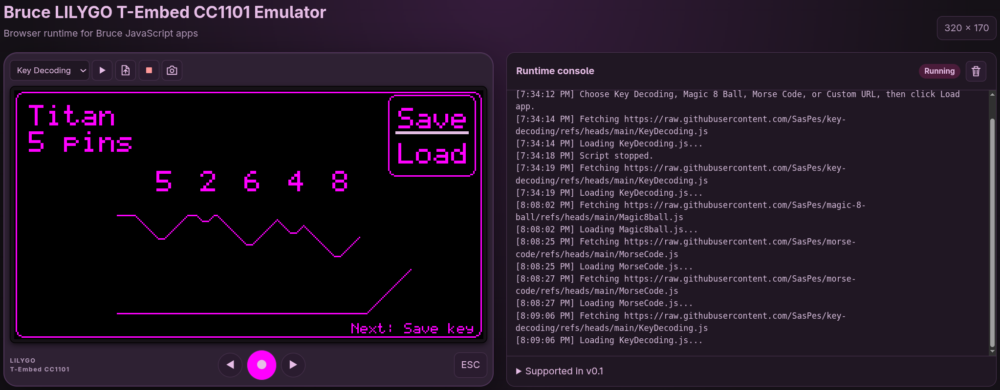

# Bruce LILYGO T-Embed CC1101 Web Emulator

A browser emulator for Bruce JavaScript apps on the LILYGO T-Embed CC1101,
with a **320 x 170** pixel display.

**Live emulator:** [bruce-js-app-emulator.saspes.workers.dev](https://bruce-js-app-emulator.saspes.workers.dev/)



## Run

Requires **Python 3** and a modern browser. No additional packages or build step.
From the project directory:

```bash
python3 start-server.py
```

Open [localhost:8080](http://localhost:8080)

Use the included server for `SharedArrayBuffer` support. Opening `index.html`
directly or using `python3 -m http.server` will not work.

## Deploy to Cloudflare Pages

The whole emulator runs in the browser and can be hosted on Cloudflare Pages'
Free plan. No Python server, Pages Functions, dependencies, or environment
variables are needed in production.

1. Push the project, including `_headers`, to GitHub.
2. In Cloudflare, open **Workers & Pages > Create application > Pages** and
   import the GitHub repository.
3. Use the following deployment settings:

| Setting | Value |
| --- | --- |
| Framework preset | None |
| Production branch | `main` |
| Root directory | Default (repository root) |
| Build command | `mkdir -p dist && cp index.html style.css app.js pixel-renderer.js _headers dist/` |
| Build output directory | `dist` |
| Environment variables | None |

4. Select **Save and Deploy**, then open the generated HTTPS `*.pages.dev` URL.
   Subsequent pushes to `main` deploy automatically.

The build command only copies the browser assets, so local server and IDE files
are not published. The `_headers` file must be in the deployment output: it sets
`Cross-Origin-Opener-Policy: same-origin` and
`Cross-Origin-Embedder-Policy: require-corp`, which enable the cross-origin
isolation required by `SharedArrayBuffer`. Cloudflare provides HTTPS.

Custom script URLs must use HTTPS and allow CORS from the deployed site.
Hosting on Pages does not bypass restrictions imposed by script hosts; download
and upload the script locally if its URL is blocked.

## Usage

- Select **Key Decoding**, **Magic 8 Ball**, **Morse Code**, or an app under **Apps from Bruce App Store**, then click the play icon.
- Use **Custom URL** or the upload icon to load another `.js` app.
- **Stop** ends the app; the camera icon saves the display as a **640 x 340 PNG**.

Presets require internet access. If CORS blocks a URL, download the script
and upload it locally.

## Controls

| Key | Action |
| --- | --- |
| Left Arrow | Previous |
| Enter | Select |
| Right Arrow | Next |
| Escape | Back |

On-screen buttons provide the same controls.

## Supported features

- `require("display")`
- `require("keyboard")`
- `require("dialog")` success messages and virtual file picker
- `require("audio")` tone playback and stop
- `require("device")` name, board, model, Bruce version, battery, heap, and EEPROM information
- `require("wifi")` IP and MAC address getters only
- `require("storage")` in-memory files and space information
- `display.getRotation()` and `display.getBrightness()`
- `display.createSprite()` offscreen drawing and push
- `delay(ms)`
- `print()` / `println()`
- Display drawing, text, colors, XBitmap
- Blocking Bruce-style polling loops
